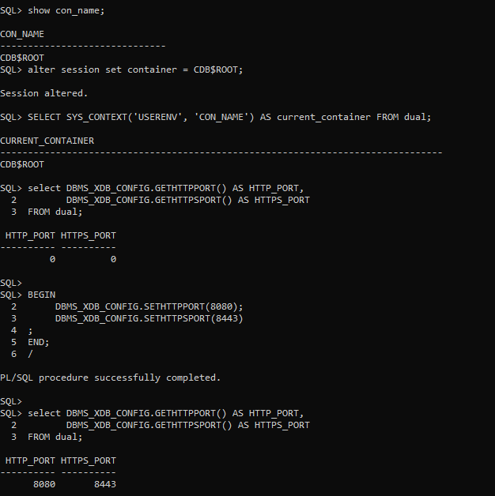

--------------Oracle PDB Creation and Management---------------

^^^^^^^^^ SQL Queries ^^^^^^^^^

This section outlines the SQL queries used to create, manage, and delete pluggable databases (PDBs), along with explanations for each step. The commands were executed on Oracle Database 21c.

1. Check User and Instance Information
These queries verify the current user and instance:
show user;
select instance_name from v$instance;
Explanation:
show user: Displays the current connected user, in this case SYS.
select instance_name from v$instance: Fetches the name of the current instance, which is orcl.

2. View PDBs and Data Files
These queries help to check the existing PDBs and associated data files:
show pdbs;
select con_id, tablespace_name, file_name from cdb_data_files;
Explanation:
show pdbs: Lists all pluggable databases in the CDB.
select con_id...: Retrieves information on data files for each container.

3. Set File Destination
To set the file destination for Oracle Managed Files (OMF):
ALTER SYSTEM SET db_create_file_dest='C:\Users\PC\Documents\SQL 1\ORCL\' SCOPE=BOTH;
Explanation: Sets the default file destination for the pluggable databases being created.

4. Create Pluggable Databases
a) Create plsql_2024db PDB:
CREATE PLUGGABLE DATABASE plsql_2024db ADMIN USER th_plsqlauca IDENTIFIED BY 1234;
Explanation: Creates a pluggable database named plsql_2024db with an admin user th_plsqlauca.
b) Create th_to_delete_pdb PDB:
CREATE PLUGGABLE DATABASE th_to_delete_pdb ADMIN USER th_delete_user IDENTIFIED BY 1234;
Explanation: Creates another PDB named th_to_delete_pdb.

5. Verify PDB Creation and Status
These queries confirm the status and mode of PDBs:
SELECT pdb_name, status FROM cdb_pdbs;
select name, open_mode from v$pdbs;
Explanation:
SELECT pdb_name...: Checks the status of all PDBs, showing whether they are created and in the "NEW" state.
select name, open_mode...: Lists the open mode of all PDBs (e.g., MOUNTED or READ WRITE).

6. Open and Save State of PDBs
To open the PDB and save its state for automatic opening during future restarts:
ALTER PLUGGABLE DATABASE plsql_2024db OPEN;
ALTER PLUGGABLE DATABASE th_to_delete_pdb OPEN;

ALTER PLUGGABLE DATABASE plsql_2024db SAVE STATE;
ALTER PLUGGABLE DATABASE th_to_delete_pdb SAVE STATE;
Explanation:
ALTER PLUGGABLE DATABASE... OPEN: Opens the specified PDB.
ALTER PLUGGABLE DATABASE... SAVE STATE: Saves the open state for persistence across reboots.

7. Unplug and Drop PDB
To unplug and drop the th_to_delete_pdb PDB:
ALTER PLUGGABLE DATABASE th_to_delete_pdb UNPLUG INTO 'C:\setup\app\paccy\admin\orcl\dpdump\th_to_delete_pdb.xml';

DROP PLUGGABLE DATABASE th_to_delete_pdb INCLUDING DATAFILES;
Explanation:
UNPLUG...: Unplugs the PDB into an XML file, preparing it for deletion.
DROP PLUGGABLE DATABASE...: Drops the PDB and its associated datafiles.

8. Additional Queries for Container Information
To view the container's open mode and current state:
select name, open_mode from v$containers;

show con_name;
Explanation:
select name...: Shows the current open mode of all containers.
show con_name: Displays the current container name (e.g., CDB$ROOT).

9. Setup HTTP and HTTPS Ports for XDB
To configure XDB HTTP and HTTPS ports:
BEGIN
    DBMS_XDB_CONFIG.SETHTTPPORT(8080);
    DBMS_XDB_CONFIG.SETHTTPSPORT(8443);
END;
/
Explanation: This PL/SQL block sets up HTTP (port 8080) and HTTPS (port 8443) for Oracle XDB.

10. Shut Down Database
Finally, the database can be shut down safely with:
SHUTDOWN IMMEDIATE;
Explanation: This command shuts down the Oracle database instance immediately, ensuring that all connected users and sessions are terminated.

11. EOM WEBSITE

TO SUM_UP:
In this project, we successfully created and managed pluggable databases (PDBs) in Oracle, including creating users, configuring file destinations, and performing essential tasks such as opening, saving states, and dropping PDBs. This process demonstrates a hands-on understanding of Oracle's multitenant architecture and database administration capabilities.